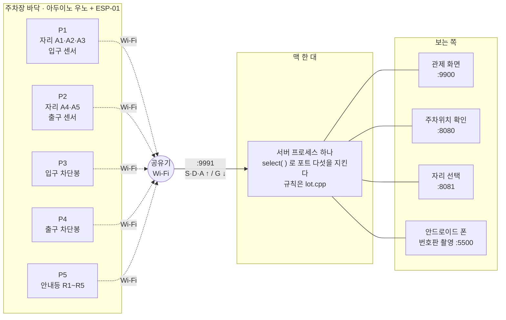
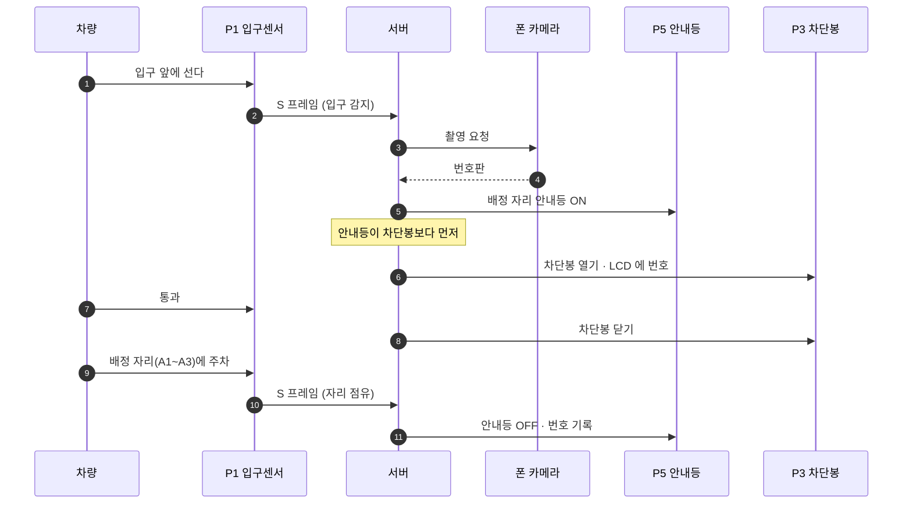

# 스마트 주차장

아두이노 다섯 대가 센서·차단봉·안내등을 맡고, 맥 한 대의 서버가 전부를 조율한다.
안드로이드 폰이 입구에서 번호판을 찍고, 웹 화면 셋으로 관제·이용자 안내를 한다.



```
① 보드 다섯 대는 각자 Wi-Fi 로 서버에 붙는다 — 서로 이야기하지 않는다
② 서버는 프로세스 하나다 — 포트 다섯을 그 하나가 연다
③ 오가는 것은 사람이 읽을 수 있는 한 줄짜리 텍스트 프레임이다
```

### 입차 시퀀스



## 구성

| 폴더 | 무엇 | 문서 |
|---|---|---|
| `ardu/` | 보드 펌웨어 p1~p5 (우노 + ESP-01) | `ardu/README.md` |
| `server/` | 주차 서버 (C++11, 외부 의존 없음) | `server/README.md` |
| `VS_server/` | 같은 서버의 Visual Studio 판 (윈도우 빌드는 미검증) | `VS_server/server/README.md` |
| `android/` | 번호판 촬영 앱 `digitcam` (arm64 실기기용) | `android/README.md` |
| `web/` | 화면 셋 — 관제·위치확인·자리선택 | `web/README.md` |
| `doc/` | 동작 원리 설명서 (처음 보는 사람용) | 아래 참고 |

### 보드 역할
| 보드 | 담당 |
|---|---|
| P1 | 자리 A1·A2·A3 · 입구 센서 |
| P2 | 자리 A4·A5 · 출구 센서 |
| P3 | 입구 차단봉 (서보) |
| P4 | 출구 차단봉 (서보) |
| P5 | 안내등 R1~R5 (릴레이) |

모든 보드에 LCD가 하나씩 붙어 있다.

### 서버 포트
| 포트 | 상대 |
|---|---|
| 9991 | 아두이노 다섯 대 |
| 9900 | 관제 화면 (`index.html`) |
| 8080 | 이용자 — 내 차 위치 확인 (`user8080.html`) |
| 8081 | 이용자 — 자리 선택 (`user8081.html`) |
| 5500 | 안드로이드 폰 (번호판) |

## 빠른 시작

```bash
# 1) 서버
cd server
c++ -std=c++11 -O2 server.cpp lot.cpp -o srv
./srv --no-chooser          # --no-chooser 는 최종 구성의 일부다 (빼면 8081 선택 갈래가 켜진다)

# 2) 보드 (p1~p5 각각) — 자가검사를 통과해야 굽는다
python3 ardu/preburn.py ardu/p3 --device P3
arduino-cli upload -p <포트> --fqbn arduino:avr:uno ardu/p3

# 3) 앱 — 설치 후 카메라 권한 허용, [설정]에서 서버 주소·포트 입력
cd android && ./gradlew assembleDebug
adb install -r app/build/outputs/apk/debug/app-debug.apk
```

화면은 서버가 내준다: `http://<서버IP>:9900/`, `:8080/`, `:8081/`.
서버 주소는 보드 `pN/Config.h`의 `SERVER_IP`, 앱의 설정 화면 두 곳에 맞춰 넣는다.

## 알아 둘 것

- **이 폴더는 사진이다.** 정본은 `서머리/server`·`서머리/ardu`이고, 고치는 곳도 그쪽이다.
- 프로토콜은 한 줄 텍스트 프레임 넷(`S` 상태 · `D` 등록 · `A` 응답 · `G` 명령)이다.
  체크섬은 **끝의 쉼표까지** XOR 한다.
- 보드는 등록(`D`)을 보낸 뒤에야 명령을 받는다.
- 보드·서버 모두 `delay`/`sleep`을 쓰지 않는다 — ESP-01 링크가 66ms 이상 막히면 끊긴다.
- 센서 값 `unknown`은 "비었다"가 아니라 "못 쟀다"이다.
- 서버를 재시작하면 명령 번호(`rid`)가 1부터 다시 시작한다 — 이상이 아니다.

## 더 읽을 것

- `doc/1-네트워크와-패킷-흐름.md` — ESP-01 AT 사다리, 포트, 프레임, 끊김의 종류
- `doc/2-동작구조와-시퀀스.md` — 이벤트 루프, 훅, 입차 시퀀스, 슬롯
- 주차장 규칙 전부는 `server/lot.cpp` 한 파일에 있다.
