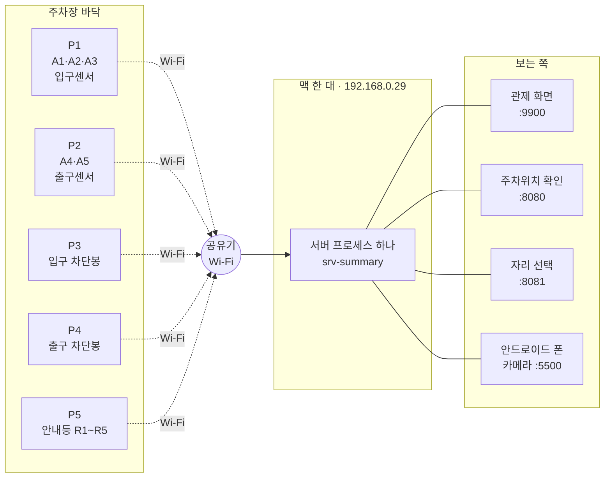
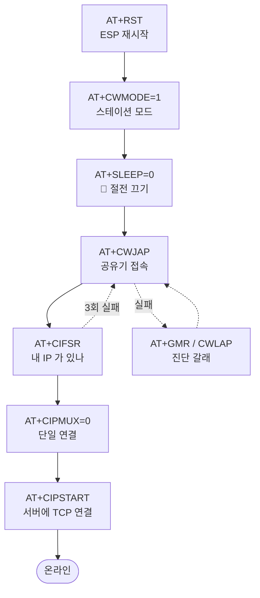
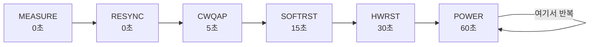
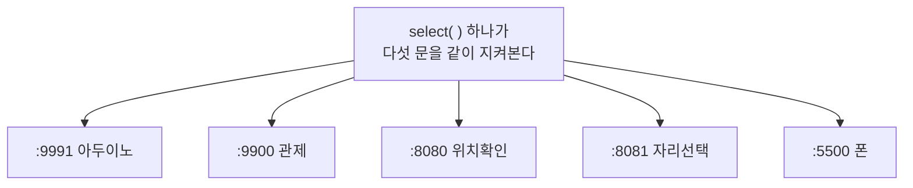
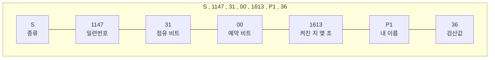
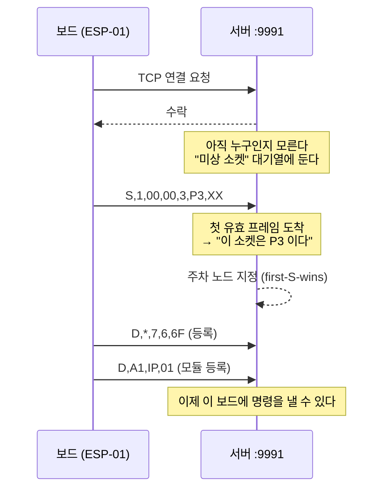
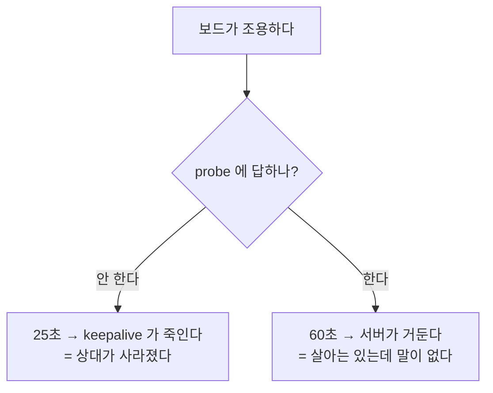
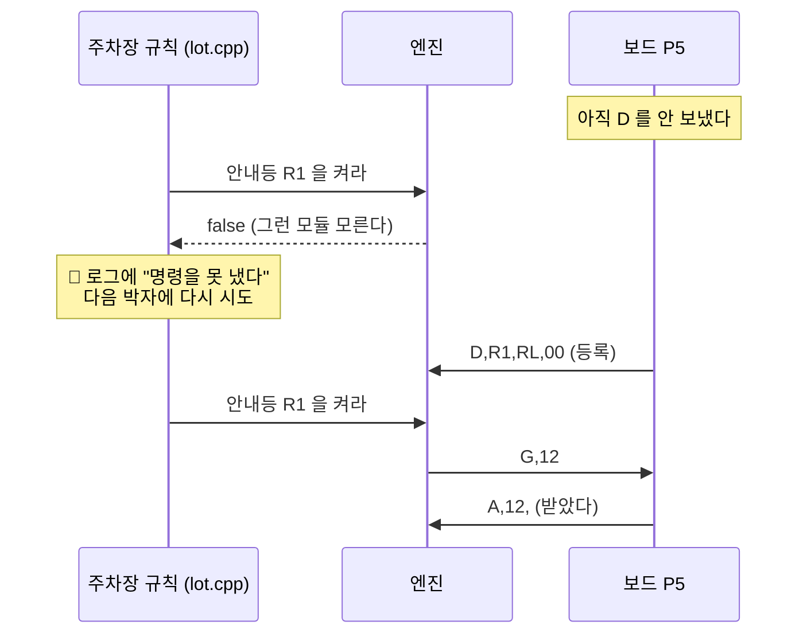
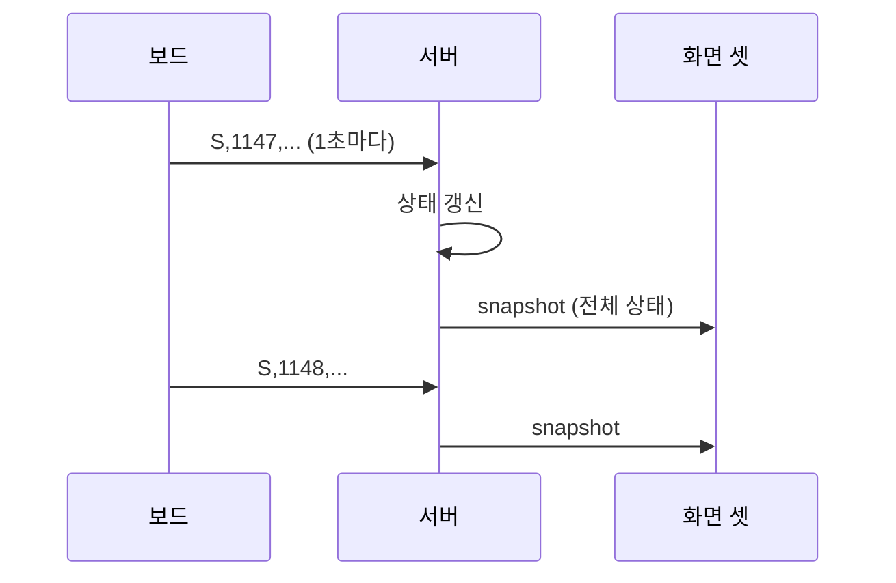

# ① ESP-01 과 서버는 어떻게 이야기하나

> **읽는 사람** — 이 주차장 시스템을 처음 보는 사람.
> C/C++ 을 조금 읽을 줄 알면 충분하고, 네트워크를 몰라도 됩니다.
>
> **기준 판** : 서버 6차 배포 · pid 32812 · 2026-08-27 12:05:57
> 아래 값은 **그 판을 실제로 재서** 적은 것입니다. 판이 바뀌면 다시 재야 합니다.

---

## 0. 한 장으로 보는 전체



**핵심 셋만 먼저 기억하십시오.**

```
① 아두이노 다섯 대가 각각 Wi-Fi 로 서버에 붙는다 — 서로 이야기하지 않는다
② 서버는 프로세스 하나다 — 포트 다섯을 그 하나가 연다
③ 오가는 것은 사람이 읽을 수 있는 짧은 텍스트 한 줄이다
```

---

## 1. 아두이노는 왜 ESP-01 이 필요한가

아두이노 우노에는 **랜선 구멍도 Wi-Fi 도 없습니다.** 그래서 옆에 작은 Wi-Fi 칩을 하나 붙입니다.
그것이 **ESP-01** 입니다.


> ### 🔑 **ESP-01 은 "모뎀" 이지 "컴퓨터" 가 아닙니다.**
> 우노가 **글자로 명령을 보내면** ESP-01 이 그대로 합니다.
> 그 명령이 전부 `AT` 로 시작해서 **AT 명령**이라고 부릅니다.

```
우노 → ESP :  AT+CIPSEND=12<CR><LF>
ESP → 우노 :  OK
```

**즉 우노 입장에서 네트워크란 "글자를 주고받는 시리얼 포트" 일 뿐입니다.**
이 사실 하나가 뒤에 나오는 모든 제약의 뿌리입니다.

### 🔴 첫 번째 헷갈리는 자리 — **시리얼이 둘이다**


| | 이름 | 핀 | 보율 | 무엇 |
|---|---|---|---|---|
| Wi-Fi 쪽 | `wifi` | D8 = ESP TX→우노 RX · D7 = 우노 TX→ESP RX | **9600** | ESP-01 과 이야기 |
| 사람 쪽 | `Serial` | D0/D1 (USB) | **115200** | 로그를 사람이 본다 |

> ### ⚠ **로그에 보이는 `[AT] "…"` 는 ESP 가 PC 에게 한 말이 아닙니다.**
> **우노가 ESP 에게 들은 것을 USB 로 다시 적어 준 것**입니다. 선이 다릅니다.

### 배선에서 알아 둘 것

```
🔴 ESP-01 은 **3.3V** 소자입니다. 우노 핀은 5V 라 직접 물리면 안 됩니다
🔴 **리셋선은 아예 없습니다**(`ESP_RST_WIRED = 0` · 설계 확정)
   → 그래서 리셋은 전부 `AT+RST`(소프트웨어)로 합니다
⚠ SoftwareSerial 은 **반이중**입니다 — 보내는 동안 못 듣습니다
   ★ 이 성질이 뒤에 나오는 "슬롯" 의 이유입니다(문서 ② §4)
```

---

## 2. 링크가 서기까지 — **AT 사다리**

전원이 들어오면 우노는 ESP-01 에게 **정해진 순서로 명령을 던집니다.** 사다리를 오르듯 한 칸씩입니다.



| # | 보내는 것 | 무엇을 기다리나 | 시한 |
|---|---|---|---|
| 0 | `AT+RST` | **안 본다 — 시간만 채운다** | 2500ms |
| 1 | `AT+CWMODE=1` | 안 본다 | 800ms |
| 2 | `AT+SLEEP=0` | 안 본다 | 800ms |
| 3 | `AT+CWJAP="SSID","PASS"` | `WIFI GOT IP` 또는 `OK` | 30000ms |
| 4 | `AT+CIFSR` | 쓸 만한 IP (`0.0.0.0` 은 아님) | 2500ms |
| 5 | `AT+CIPMUX=0` | `OK` / `no change` | 1200ms |
| 6 | `AT+CIPSTART="TCP","192.168.0.29",9991` | `CONNECT` | 8000ms |

> ### ⚠ **"시한이 끝났다" 가 "실패했다" 는 뜻은 아닙니다.**
> 0·1·2 번은 **응답을 아예 안 봅니다.** 시간만 채우고 다음으로 갑니다 —
> ESP 가 `OK` 를 늦게 줘도 상관없게 만든 것입니다.
> ★ 응답을 **정말 보는** 단계는 `CWJAP` · `CIFSR` · `CIPMUX` · `CIPSTART` 넷입니다.

### 🔴 `AT+SLEEP=0` — 이 한 줄이 오늘 큰 값을 냈습니다

```
AT+SLEEP=<mode>   0 = 절전 없음
                  1 = light-sleep
                  2 = modem-sleep  ← 🔴 **ESP-01 의 기본값**
```

기본값인 modem-sleep 은 **공유기의 DTIM 주기에만 무선을 켭니다.** 그러면 서버가 보낸
TCP ACK 이 늦거나 묻히고, 장치는 *"보냈는데 답이 없다"* 로 판단해 **소켓을 다시 엽니다.**

```
실측 2026-08-27 — 다섯 대 중 넷이 절전이 켜진 채 돌고 있었다
   절전 켜짐 : 재접속 **85.7 회/시간**
   절전 끔   : 재접속 **4 회/시간** (15분)
```

> ### ⚠ 그런데 **증상은 "링크가 자꾸 끊긴다" 뿐**이라, 우리는 한동안 **전원·기판·환경**을 의심했습니다.
> ### 🔑 **소프트웨어 한 줄이 하드웨어 고장처럼 보일 수 있습니다.**

⚠ 그리고 `AT+SLEEP` 은 **플래시에 저장되지 않습니다.** `AT+RST` 하면 기본값(2)으로 돌아가므로
**리셋할 때마다 다시 보내야 합니다.** 그래서 사다리의 `RST` 바로 뒤에 있습니다.

### 안 붙으면 — **백오프 사다리를 내려갑니다**



**실패가 쌓일수록 더 세게, 더 천천히 시도합니다.**
그리고 **온라인이 30초 연속 유지되면 맨 아래 칸으로 되돌아옵니다.**

```
🔵 즉 잠깐 끊겼다 붙으면 벌점이 사라집니다 — 계속 나빠지기만 하지 않습니다
```

---

## 3. 지금 열려 있는 문 — 포트 다섯

서버는 **프로세스 하나**인데 문을 다섯 개 엽니다. 각 문마다 오는 손님이 다릅니다.

| 포트 | 누가 오나 | 무엇을 하나 |
|---|---|---|
| **9991** | 아두이노 다섯 대 | 상태를 올리고 명령을 받는다 |
| **9900** | 관제 화면 | 전부 본다 · 조작한다 |
| **8080** | 이용자 | "내 차 어디 있나" |
| **8081** | 이용자 | "자리 고르기" |
| **5500** | 안드로이드 폰 | 번호판을 찍어 올린다 |



> ### ⚠ **문이 하나 안 열려도 서버는 뜹니다.**
> ```
> ⚠ 이용자 포트 8081 를 못 열었다 — 자리 선택 화면만 못 쓴다. 자동 배정으로 돈다
> ```
> ★ **부분 실패를 말하고 계속 도는 것**이 이 서버의 성격입니다. 로그를 안 보면 모릅니다.

---

## 4. 오가는 글자 — 네 종류만 알면 된다

**한 줄이 한 프레임입니다.** 줄 끝(`\n`)이 곧 "여기까지" 라는 표시입니다.

### 올라가는 것 (보드 → 서버)

```
S,1147,31,00,1613,P1,36        ← 상태.  1초에 한 번
D,*,7,6,6F                     ← 등록.  "나는 이런 노드다"
D,A1,IP,01                     ← 등록.  "A1 이라는 모듈이 있다"
A,1,                           ← 응답.  "1번 명령 받았다"
```

### 내려가는 것 (서버 → 보드)

```
G,12                           ← 명령.  "12번 일을 해라"
```

### 칸이 무슨 뜻인가



| 프레임 | 칸 순서 | 뜻 |
|---|---|---|
| `S` | `S , seq , 점유 , 예약 , uptime , devid , cksum` | 1초 주기 상태 |
| `D` | `D , 모듈이름 , 종류 , 값 , cksum` | 등록 (`*` 는 노드 자체) |
| `A` | `A , rid , cksum` | 명령 응답 |
| `G` | `G , rid` | 명령 |

> ### ⚠ `seq` 는 16비트라 **18.2시간마다 0 으로 돌아갑니다.**
> 로그에서 번호가 갑자기 작아져도 **고장이 아닙니다.**

---

## 5. 🔴 **체크섬의 쉼표**

맨 뒤 두 글자는 **검산값**입니다. 앞의 글자를 전부 XOR 한 값입니다.

> ### 🔴 **끝의 쉼표까지 포함해서 계산합니다.**

```
✅ 맞다 :  "S,1147,31,00,1613,P1,"  ← 쉼표까지 XOR → 36
❌ 틀리다:  "S,1147,31,00,1613,P1"   ← 쉼표를 빼면 다른 값이 나온다
```

**쉼표를 빼먹으면 서버가 그 줄을 조용히 버립니다.** 로그에 남는 것은 이 한 줄뿐입니다.

```
! 체크섬 불일치 — 버림
```

> ### ★ **왜 틀렸는지는 안 나옵니다.** 그래서 처음 만드는 사람이 여기서 가장 오래 헤맵니다.
> 🔑 **직접 프레임을 만들 일이 있으면 이 한 칸을 제일 먼저 의심하십시오.**

---

## 6. 보드 한 대가 붙는 과정



실제 로그는 이렇게 남습니다.

```
+? 연결 수락 — 상대 192.168.0.84:11105 · device_id 대기 중(7초 안에 유효 프레임 없으면 끊는다)
= 주차 노드 지정 — device=P3 (first-S-wins: 첫 S 프레임을 보낸 장치가 주차 노드다)
+AUX 노드 접속 — device=P2 · 현재 노드 3/8 · 상·하행 활성
```

```
🔵 붙은 직후 7초 안에 유효한 프레임이 없으면 서버가 끊습니다
🔴 **등록(`D`)이 안 온 보드에는 명령이 안 나갑니다** — 뒤의 §7 을 보십시오
```

### ⚠ "주 노드" 라는 말이 로그에 나오는데

```
사용자 확정 : "주노드는 없다. 모두 동일 노드이다."
🔴 그런데 **코드에는 아직 그 구분이 남아 있습니다** — 먼저 붙은 보드가 `park`, 나머지가 `AUX`
```

**실용상 차이는 거의 없습니다** — `AUX` 도 로그에 `상·하행 활성` 으로 찍히고 명령을 받습니다.
🔑 **로그에 그 낱말이 보여도 "특별한 보드가 있다" 는 뜻이 아닙니다.** 정리는 예정돼 있습니다.

---

## 7. 끊김은 **두 가지**다 — 이게 헷갈리는 자리

| | 누가 재나 | 무엇을 보나 | 언제 |
|---|---|---|---|
| **TCP keepalive** | 커널(OS) | 상대가 **살아 있나** | 10 + 5×3 = **25초** |
| **유휴 마감** | 서버 코드 | **프레임이 오나** | **60초** |



> ### 🔑 **둘은 다른 것을 잽니다.**
> `keepalive 시간초과` = 전원이 나갔거나 Wi-Fi 가 끊겼다
> `유휴 마감` = 붙어는 있는데 프로그램이 멈췄다

로그의 `사유` 칸에 그 구별이 나옵니다.

```
사유 상대가 닫음              = 보드가 정상적으로 끊었다 (FIN)
사유 수신 오류(errno=54)      = 갑자기 끊겼다 (RST)
사유 keepalive 시간초과       = 커널이 죽였다
```

---

## 8. 🔴 **등록 안 된 모듈에는 명령이 안 나간다**

명령을 내는 함수는 **성공/실패를 돌려줍니다.** 실패하는 가장 흔한 경우가 이것입니다.

```
! 모듈 없음 — P5.R1 (그 노드 등록 0개)
! 발행 실패
▸ 🔴 명령을 못 냈다 P5/R1
```



> ### ★ 전에는 이 반환값을 **버리고** 무조건 *"안내등 ON"* 이라고 찍었습니다.
> 사용자가 *"안 들어온다"* 고 신고했는데 **로그는 켰다고 말하고 있었습니다.**
> 🔑 **명령을 낸 것과 그것이 나간 것은 다릅니다.**

---

## 9. 화면은 어떻게 최신을 아는가

화면 셋(관제·8080·8081)은 **같은 봉투**를 받습니다. 포트만 다릅니다.



```
🔵 봉투는 **`S` 프레임을 처리한 끝에** 나갑니다 — 서버가 자기 타이머로 미는 것이 아닙니다
   → 보드 1Hz × 다섯 대 = **초당 약 다섯 번**
```

> ### 🔴 그래서 **보드가 전부 끊기면 봉투도 멎습니다.**
> 화면은 **마지막 값을 그대로 들고 있습니다.**
> ### ⚠ **그것을 "값이 최신이다" 로 읽으면 안 됩니다.**
> ★ 화면이 *"몇 초 전 받은 값인가"* 를 같이 보여 줘야 하는 이유입니다.

### 봉투를 읽을 때 하나 더

```
🔴 `occupied: false` 는 **"비었다" 가 아닙니다.**
   `value_state` 를 같이 봐야 합니다 — `unknown` 이면 **못 잰 것**입니다
```

**"비었다" 와 "모르겠다" 는 다릅니다.** 이 구별을 놓치면 화면이 거짓말을 합니다.

---

## 10. 🔴 **`delay()` 를 쓰고 싶어지는 자리**

무언가를 기다려야 할 때 가장 자연스러운 첫 생각은 이것입니다.

```cpp
delay(1000);   // 1초 기다리면 되잖아
```

> ### 🔴 **이 시스템에서는 금지입니다. 링크가 죽습니다.**

```
ESP → 우노 는 9600 bps = **초당 960 바이트**
받아 두는 링버퍼는 **64 B**(우리는 128 B 로 키웠다)
   960 B/s × T ≤ 64 B  →  **T ≤ 66 ms**
```
> ### 🔴 **66 밀리초.** 그 이상 한눈팔면 버퍼가 넘치고, 그 사이 온 것이 **사라집니다.**

사라지는 것이 하필 `SEND OK`(서버가 받았다는 신호)라 장치는 *"안 갔나 보다"* 하고
**8초 뒤 소켓을 다시 엽니다.** 끊김의 정체가 이것입니다.

⚠ **`Serial.print` 도 같습니다.** USB 쪽 링버퍼(64 B)를 넘기면 그만큼 **막힙니다** —
실측 블로킹 **20.9 ms · 최악 62.5 ms**. 로그를 많이 찍으면 링크가 죽습니다.

★ 실사고: 링버퍼가 64 B 이던 시절 **등록 배치가 65 B** 여서 딱 1 바이트를 넘겼습니다.
**세션마다 끊겼습니다.** 그래서 링을 128 B 로 키웠습니다.

```
✅ 대신 쓰는 법 — **시각을 비교합니다**
   if (millis() - 시작 >= 1000) { … }        (아두이노)
   if (now_ms() - 시작 >= 1000) { … }        (서버)
```

서버도 같습니다. 기다리는 곳은 `select()` **한 곳뿐**이고, 그것도 200ms 로 짧습니다.

---

## 11. 정리 — 한 번 더

```
① ESP-01 은 모뎀이다. 우노는 글자(AT)로 그것을 조종한다
② 프레임은 한 줄짜리 텍스트다. S(상태) D(등록) A(응답) G(명령) 넷뿐이다
③ 체크섬은 **끝의 쉼표까지** 센다. 틀리면 조용히 버려진다
④ 등록(D)이 와야 명령이 나간다
⑤ 끊김은 둘이다 — 사라진 것(25초)과 말이 없는 것(60초)
⑥ 봉투는 보드 프레임에 얹혀 간다. 보드가 없으면 화면도 멎는다
⑦ `delay()` 는 링크를 죽인다 — **66 ms 가 한계**다. 시각을 비교해라
⑧ 절전(`AT+SLEEP`)은 리셋마다 다시 꺼야 한다
```

📖 **동작 구조와 시퀀스**는 같은 폴더의 `2-동작구조와-시퀀스.md` 를 보십시오.
