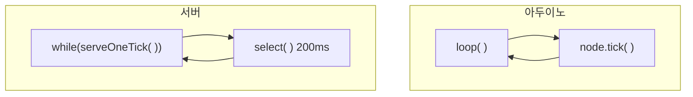
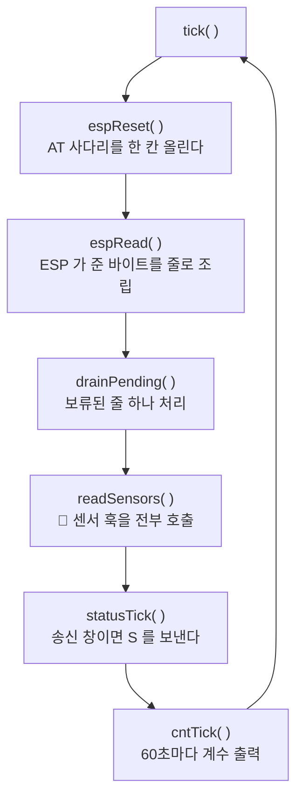
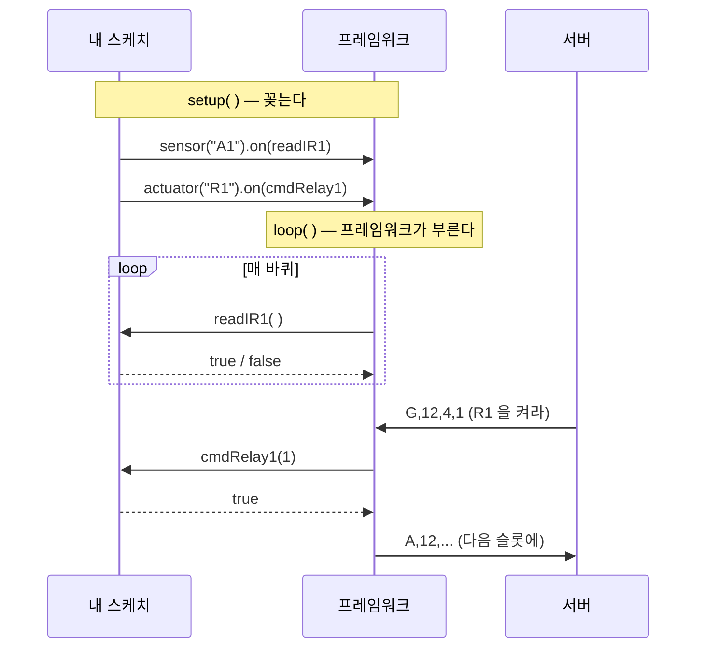
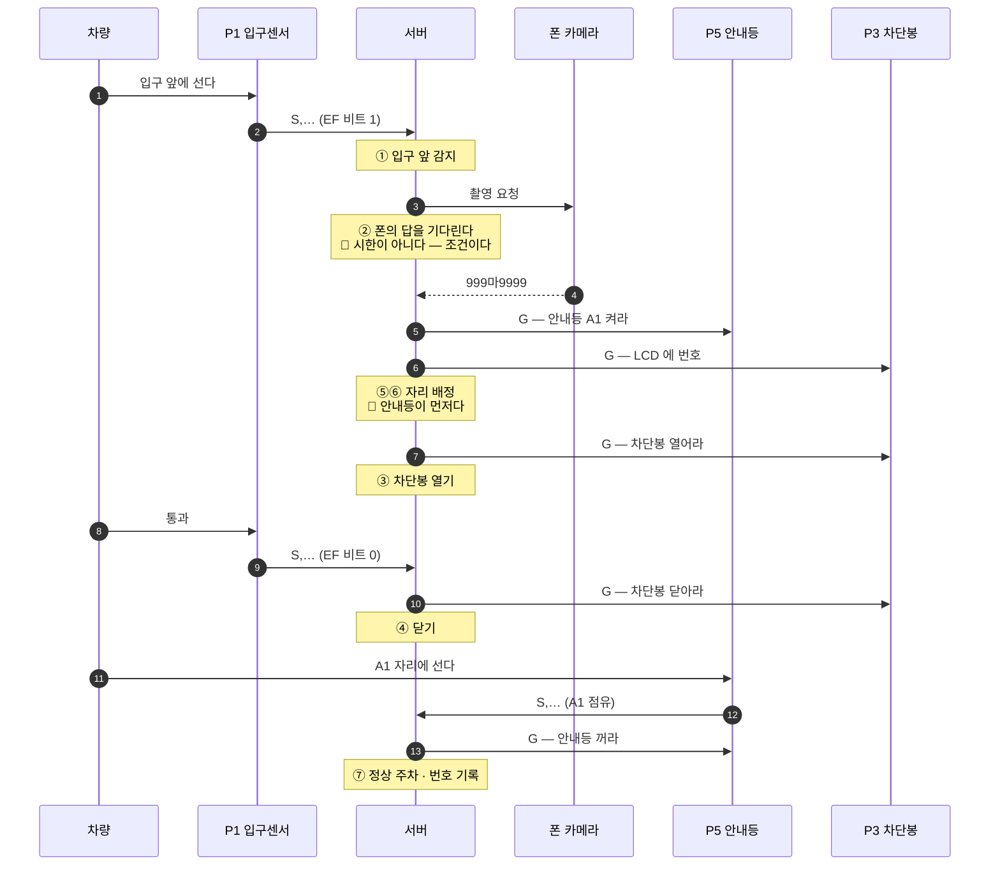
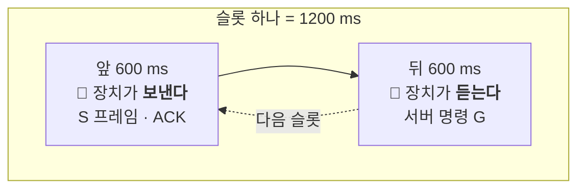
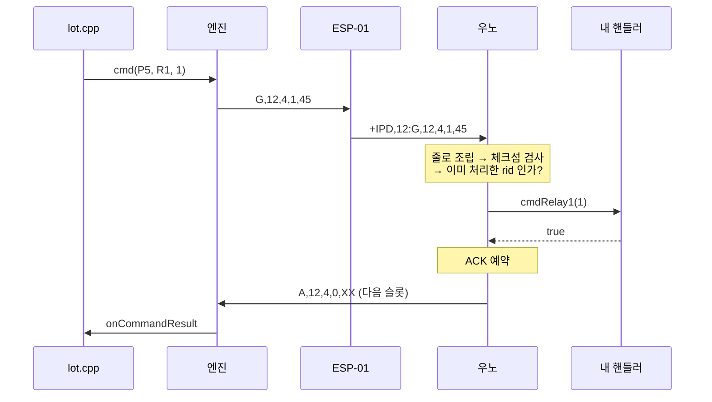
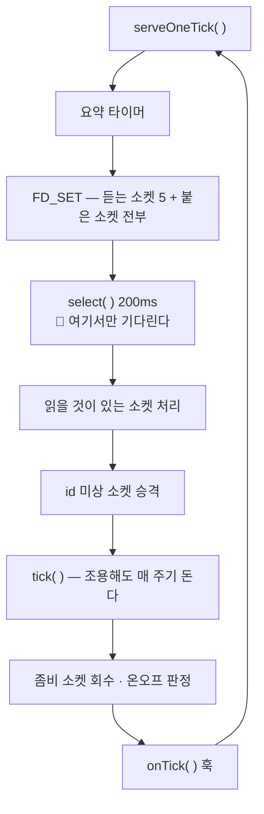

# ② 아두이노와 서버는 어떻게 도나 — 루프 · 훅 · 시퀀스

> **먼저 `1-네트워크와-패킷-흐름.md` 를 읽고 오십시오.** 여기서는 그 위에서 **무엇이 언제 도는가**를 봅니다.
>
> **기준 판** : 아두이노 hex `p1 81ab4bf6` 외 다섯 · 서버 6차 pid 32812 (2026-08-27 12:05:57)

---

## 0. 두 프로그램의 뼈대는 같습니다



```
🔵 둘 다 **한 바퀴를 아주 빨리 돌면서 "지금 할 일이 있나" 만 봅니다**
🔴 둘 다 **자지 않습니다** — `sleep`·`delay` 가 없습니다
```

> ### 🔑 **이 구조를 "이벤트 루프" 라고 부릅니다.**
> 기다릴 일이 있으면 **멈춰서 기다리는 게 아니라, 시각을 적어 두고 다음 바퀴에 다시 봅니다.**

```cpp
❌ delay(1000);                              // 멈춰서 기다린다
✅ if (millis() - 시작 >= 1000) { … }        // 적어 두고 다음 바퀴에 본다
```

---

## 1. 아두이노 — `tick()` 한 바퀴



**한 바퀴는 보통 수백 마이크로초**입니다. 눈 깜짝할 사이에 수천 번 돕니다.

```
🔴 바퀴가 길어지는 자리는 **딱 하나** — ESP 로 실제 바이트를 밀어 넣을 때입니다
   (1.04 ms/B · 그래서 16 바이트마다 수신을 한 번씩 비웁니다)
```

---

## 2. "훅" 이란 무엇인가

**프레임워크가 정해진 때에 불러 주는 내 함수**입니다.
내가 언제 불릴지 정하지 않습니다 — **꽂아 두기만 하면 됩니다.**

### 아두이노에는 **두 종류**뿐입니다

```cpp
typedef bool (*SensorFn)(void);            // 센서  : 매 바퀴 불린다. true = 찼다
typedef bool (*CommandFn)(uint32_t arg);   // 액추에이터 : 명령이 오면 불린다
```

```cpp
// setup() 에서 꽂는다 — 이 한 줄이 전부다
node.sensor  ("A1").on(readIR1);
node.actuator("R1").on(cmdRelay1);
```



> ### ⚠ **등록하는 자리와 불리는 자리가 다릅니다.**
> `setup()` 에서 한 줄 꽂고, 호출은 `tick()` 안에서 프레임워크가 합니다.
> **언제 불리는지는 내가 정하지 않습니다.**

### 🔴 등록 순서가 곧 번호입니다

```
node.sensor("A1")  ← 0번
node.sensor("A2")  ← 1번
node.sensor("A3")  ← 2번
```

이 번호가 **`S` 프레임의 점유 비트 자리**이고, 서버가 명령을 보낼 때 쓰는 `idx` 입니다.

> ### 🔴 **등록 순서를 바꾸면 서버가 다른 모듈을 조작합니다.** 컴파일은 통과합니다.

⚠ **값이 변할 때 불리는 콜백은 없습니다.** 변화 감지는 프레임워크가 직접
이전 값과 비교해서 합니다. (예전에 있던 `onModuleValue` 는 폐기됐습니다.)

### 서버의 훅 — **여섯**

```cpp
srv.onCommandResult(...)      // 명령 결과가 왔다
srv.onOccupancyChanged(...)   // 자리 점유가 바뀌었다   ← 정상 주차 판정이 여기서
srv.onManualPlate(...)        // 손으로 번호를 넣었다
srv.onSlotPick(...)           // 8081 에서 자리를 골랐다
onControllerReset(...)        // 제어기 초기화
onTick(srv)                   // 매 바퀴
```


> ### 🔑 **엔진은 "무슨 일이 생겼는지" 만 알리고, `lot.cpp` 가 "그래서 무엇을 할지" 를 정합니다.**
> ### ★ 그래서 **`lot.cpp` 하나만 열면 이 주차장의 규칙이 전부 보입니다.**

---

## 3. 🔴 입차 한 건 — 처음부터 끝까지

**이 문서에서 가장 중요한 그림입니다.**



### 🔴 **안내등이 차단봉보다 먼저입니다** — 순서를 뒤집지 마십시오

소스에 그 이유가 적혀 있습니다.

```
차단봉이 먼저 열리면 운전자가 **어디로 갈지 모르는 채로** 들어온다.
```

실제 로그가 이 순서입니다.

```
① 입구 앞 감지 — 촬영을 시작한다
② 촬영 요청 8 (1회째)
번호 도착 — 999마9999 (촬영 1회째 · 100ms)
⑤⑥ 자리 A1 배정(자동 · 안내만) — 안내등 ON · LCD 에 번호
③ 입구 차단봉 열기
```

### 기다리는 방식 — **시한이 아니라 조건**

```
②에서 폰을 기다리는 것은 **무한**입니다. "10초 지나면 포기" 같은 것이 없습니다
   조건 : ① 폰이 붙어 있고 ② 차가 아직 있는 **동안** 기다린다
🔵 차가 떠나면 **4초** 뒤 접습니다
```

> ### 🔴 그런데 여기에 가장 위험한 자리가 있습니다.
> 링크가 3.5초 끊기면 센서 값이 `unknown` 이 됩니다.
> ### ⚠ **`unknown` 은 "차가 없다" 가 아닙니다. "모르겠다" 입니다.**
> 그래서 `unknown` 이면 **4초 시계를 멈춥니다.** 안 멈추면 있는 차를 없다고 판단합니다.

---

## 4. 🔴 슬롯 — 왜 즉시 안 보내나

ESP-01 링크는 **반이중**입니다. **보내는 동안 못 듣습니다.**
그래서 시간을 갈라 씁니다.



| 상수 | 값 | 뜻 |
|---|---|---|
| `SLOT_MS` | **1200** | 한 슬롯. `S` 는 슬롯당 최대 1회 |
| `TX_WINDOW_MS` | **600** | 앞 600ms = 장치 송신 창 |
| `SEND_GAP_MS` | 80 | 연속 전송 최소 간격 |

```
🔵 그래서 상행은 **약 0.83 Hz** 입니다(1200ms 에 한 번)
🔴 센서가 바뀌어도 **슬롯을 앞당기지 않습니다** — 다음 슬롯에 실립니다
   → 최악 **1.2초** 늦습니다
```

> ### ⚠ **ACK 도 즉시 안 나갑니다.** 다음 슬롯의 배치에 실립니다.
> ### ★ 화면이 "1초쯤 늦게" 반응하는 것은 **정상입니다.** 고장이 아닙니다.

서버는 `S` 를 받은 **직후**에 명령을 내립니다. 그래야 장치의 **듣는 창**에 닿습니다.
어긋나면 로그에 이 표지가 남습니다.

```
[SLOT-OOW] +<ms>     ← out of window. 창 밖에 왔다
```

---

## 5. 명령이 나가고 돌아오기까지



```
🔵 `rid` = 명령 하나에 붙는 번호. 각 명령이 자기 번호와 자기 응답을 가집니다
🔵 같은 `rid` 가 또 오면 **다시 실행하지 않고 같은 응답을 재전송**합니다 (멱등)
⚠ 응답이 없으면 재전송 — **2.4초 × 3회**
🔴 `rid` 는 **서버가 재시작하면 1 부터 다시** 시작합니다. 로그에서 번호가 되감겨도 이상이 아닙니다
```

### 거절도 응답을 보냅니다

```
result = 0  성공
result = 3  거절 — 등록 안 된 모듈이거나 핸들러가 false 를 냈다
```

> ### 🔑 **"안 갔다" 와 "갔는데 거절됐다" 는 서버가 갈라야 합니다.**
> 그래서 거절할 때도 반드시 답을 보냅니다.

---

## 6. 서버 — 한 바퀴



> ### 🔑 **`select()` 하나가 다섯 문과 붙어 있는 소켓 전부를 같이 지켜봅니다.**
> 소켓마다 스레드를 만들지 않습니다.

```
🔴 모든 시한은 `now_ms()` 비교로 잽니다 — **단조 시계**입니다
   ★ 벽시계로 재면 시각 보정에 흔들립니다
```

---

## 7. 초급자가 막히는 자리 — 모아 두기

```
[1] 🔴 **시리얼이 둘이다** — wifi(D7/D8·9600)와 Serial(USB·115200)은 다른 선
[2] 🔴 **체크섬은 끝의 쉼표까지** — 틀리면 조용히 버려진다
[3] 🔴 **등록(D)이 와야 명령이 나간다** — 안 그러면 "모듈 없음"
[4] 🔴 **delay() 는 66ms 가 한계** — 넘으면 링크가 죽는다
[5] 🔴 **등록 순서 = 비트 자리 = idx** — 순서를 바꾸면 다른 모듈이 움직인다
[6] 🔴 **ACK 는 최대 1.2초 늦다** — 화면이 늦게 반응하는 것은 정상이다
[7] 🔴 **unknown 은 "없다" 가 아니다** — 못 잰 것이다
[8] 🔴 **"시한 끝" 이 "실패" 가 아니다** — AT 사다리 앞 세 칸은 답을 안 본다
[9] 🔴 **보드가 다 끊기면 화면도 멎는다** — 마지막 값이 남아 있을 뿐이다
```

---

## 8. 어디를 열어 보면 되나

| 알고 싶은 것 | 열 곳 |
|---|---|
| **주차장 규칙 전부** | `릴리즈/server/lot.cpp` ← 🔵 여기부터 |
| 상수 · 포트 · 시한 | `릴리즈/server/config.h` |
| 서버 한 바퀴 | `릴리즈/server/serve.h` |
| 훅을 꽂는 곳 | `릴리즈/server/entry.h` |
| 스케치 (보드마다) | `릴리즈/ardu/p1/p1.ino` … `p5/p5.ino` |
| 아두이노 한 바퀴 | `릴리즈/ardu/p1/Runtime.h` |
| ESP 링크 상태기계 | `릴리즈/ardu/p1/EspLink_state.h` |
| 상수 (장치) | `릴리즈/ardu/p1/Config.h` |

> ### 🔵 **`lot.cpp` 와 `p1.ino` 둘만 읽어도 이 시스템이 무엇을 하는지 알 수 있습니다.**
> 나머지는 그 둘이 돌아가게 해 주는 바닥입니다.
